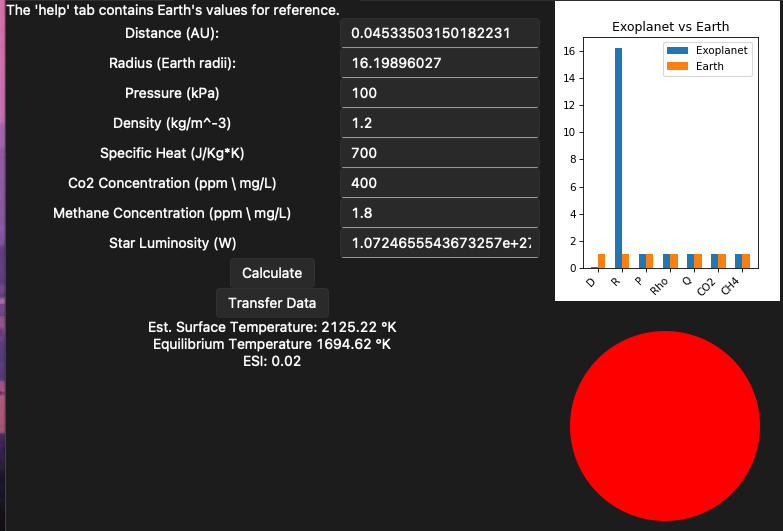

# Tkinter GUI for light curve analysis of TESS // KEPLER observations. 

# Exoplanet Light Curve Analysis Tool

A Python GUI application for analyzing TESS and Kepler light curves to detect exoplanets and estimate their physical properties, including temperature modeling.


## 🌟 Features

- **Light Curve Analysis**: Load and analyze TESS/Kepler observation files
- **Automatic Transit Detection**: Uses Box Least Squares (BLS) algorithm to identify potential exoplanets
- **Period Estimation**: Calculates orbital periods and folded light curves
- **Physical Parameter Estimation**: Estimates planet radius, semi-major axis, and orbital distance
- **Temperature Modeling**: Simulates exoplanet surface temperatures based on atmospheric parameters
- **Earth Similarity Index (ESI)**: Calculates habitability metrics
- **Data Visualization**: Interactive plots with matplotlib integration
- **MAST Archive Integration**: Direct download capability for TESS observations
- **Multi-tab Interface**: Organized workflow with separate analysis and simulation tabs

## 📋 Requirements

### Python Dependencies
```
tkinter
lightkurve
matplotlib
numpy
sv-ttk
```

### System Requirements
- Python 3.7 or higher
- Internet connection (for downloading observations)
- ~100MB free disk space for temporary files

## 🚀 Installation

1. **Clone the repository:**
```bash
git clone https://github.com/yourusername/exoplanet-analysis-tool.git
cd exoplanet-analysis-tool
```

2. **Install required packages:**
```bash
pip install lightkurve matplotlib numpy sv-ttk
```

3. **Run the application:**
```bash
python lightcurve_analysis.py
```

## 📖 Usage Guide

### 1. Light Curve Analysis Tab

#### Loading Data
- **Option A - Direct File Load**: Click "Load File" to select a local FITS file
- **Option B - MAST Download**: 
  1. Get Product Group ID from [MAST Archive](https://mast.stsci.edu/portal/Mashup/Clients/Mast/Portal.html)
  2. Enter ID in the download field
  3. Click "Download and Extract"

#### File Types
- **Unchecked (TPF)**: Target Pixel Files - raw pixel data
- **Checked (LC)**: Light Curve files - processed photometry

#### Analysis Process
1. Load your observation file
2. Set stellar mass (optional, defaults to 1 solar mass)
3. Click "Analyse Light Curve"
4. Review results: period, planet radius, orbital distance

### 2. Temperature Simulation Tab

#### Input Parameters
- **Distance (AU)**: Semi-major axis from host star
- **Radius (Earth radii)**: Planet size relative to Earth
- **Pressure (kPa)**: Atmospheric pressure
- **Density (kg/m³)**: Atmospheric density
- **Specific Heat (J/kg·K)**: Atmospheric heat capacity
- **CO2 Concentration (ppm)**: Carbon dioxide levels
- **CH4 Concentration (ppm)**: Methane levels
- **Star Luminosity (W)**: Host star's energy output

#### Transfer Data Feature
Use "Transfer Data" to automatically populate simulation parameters with values from the light curve analysis, using Earth-like atmospheric conditions as defaults.

### 3. Earth Reference Values
- Distance: 1 AU
- Radius: 1 Earth radius
- Pressure: 100 kPa
- Density: 1.2 kg/m³
- Specific Heat: 700 J/kg·K
- CO2: 400 ppm
- CH4: 1.8 ppm
- Solar Luminosity: 3.8×10²⁶ W

## 🔬 Scientific Background

### Transit Detection Method
The tool uses the Box Least Squares (BLS) periodogram to identify periodic dimming events in stellar light curves, which indicate planetary transits.

### Physical Parameter Calculations
- **Planet Radius**: Derived from transit depth and stellar radius
- **Semi-major Axis**: Calculated using Kepler's third law
- **Surface Temperature**: Uses energy balance equations with greenhouse effect modeling

### Earth Similarity Index (ESI)
Quantifies how Earth-like an exoplanet is based on:
- Surface temperature similarity
- Orbital distance comparison
- Size comparison

## 📊 Output Files

When "Auto Save figures" is enabled, the tool generates:
- `{object_name}_lightcurve.png`: Raw light curve plot
- `{object_name}_folded.png`: Phase-folded light curve
- Files saved in `{object_name}/` subdirectory

## 🔧 Technical Details

### Key Algorithms
- **BLS Periodogram**: For transit detection
- **Phase Folding**: For signal enhancement
- **Rolling Average**: For noise reduction
- **Stefan-Boltzmann Law**: For temperature calculations
- **Greenhouse Effect Modeling**: Atmospheric heating simulation

### Data Sources
- **TESS**: Transiting Exoplanet Survey Satellite
- **Kepler/K2**: NASA's planet-hunting missions
- **MAST Archive**: Mikulski Archive for Space Telescopes

## 🤝 Contributing

Contributions are welcome! Please feel free to submit pull requests or open issues for:
- Bug reports
- Feature requests
- Code improvements
- Documentation updates

## 🙏 Acknowledgments

- **Lightkurve Collaboration**: For the excellent lightkurve library
- **NASA Kepler/K2 Guest Observer Office**: For mission support
- **Space Telescope Science Institute (STScI)**: For data archiving
- **University of Bologna**: Project affiliation

## 📧 Contact

**Marco Leonardi**  
University of Bologna / University of Leiden

## 🔗 Useful Links

- [MAST Archive](https://mast.stsci.edu/portal/Mashup/Clients/Mast/Portal.html)
- [Lightkurve Documentation](https://docs.lightkurve.org/index.html)
- [TESS Mission](https://tess.mit.edu/)
- [Kepler/K2 Mission](https://www.nasa.gov/mission_pages/kepler/main/index.html)

---




