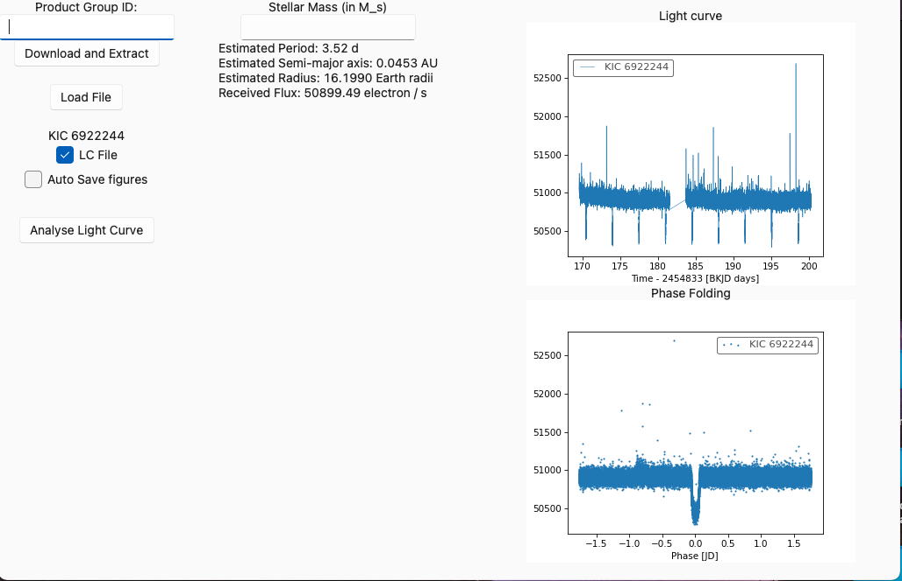
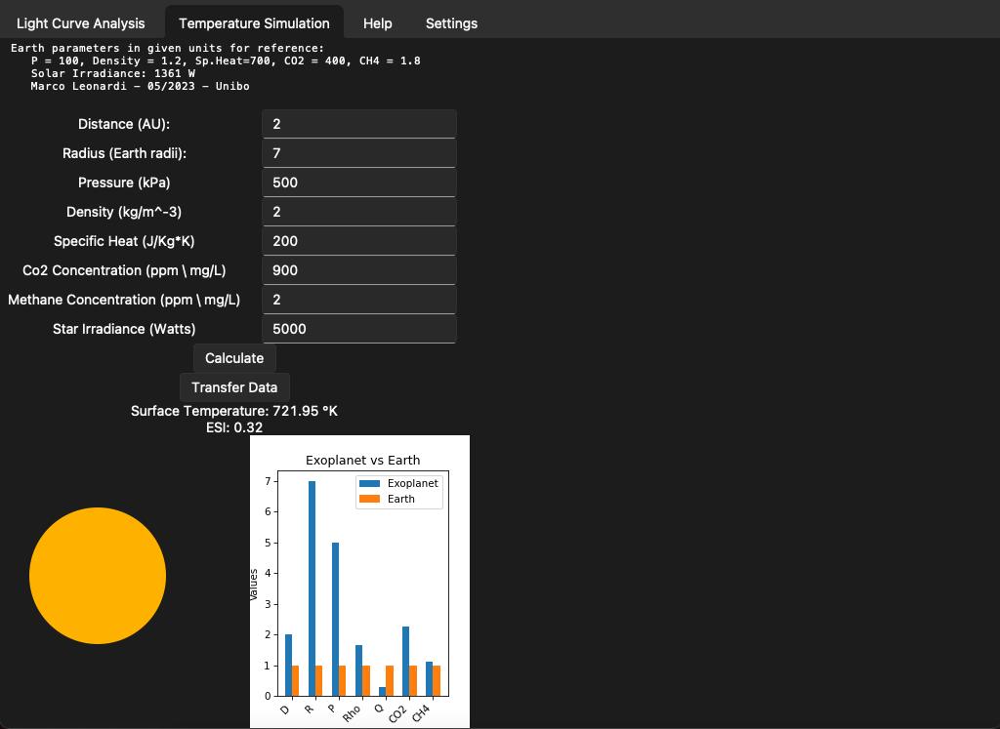
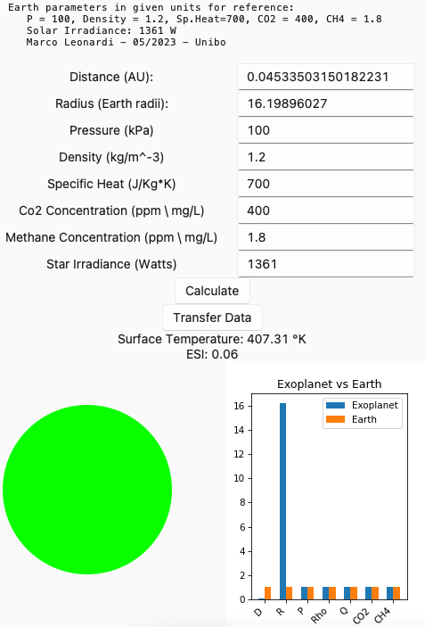
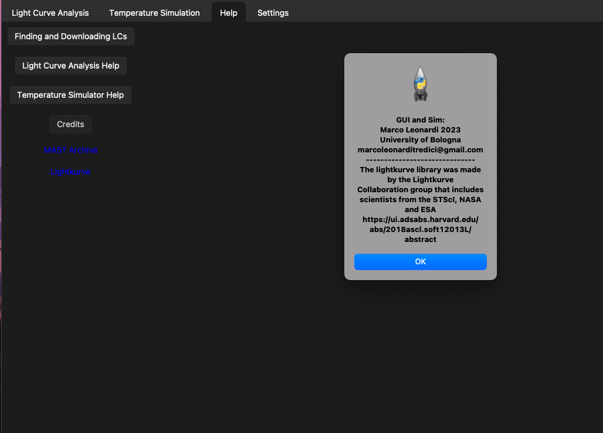

# Tkinter GUI for light curve analysis of TESS // KEPLER observations. 

This GUI is a simple extension of the _lightkurve_ python library that allows astronomy enthusiasts to study light curves (only from TESS or KEPLER missions), look for exoplanet transits and simulate atmospheric temperature of potential exoplanets. 

- 08/08/2023 Rewrote the style and theme of the GUI.
- Pictures of the three tabs added

Features to be added:

• Export all results to .csv

